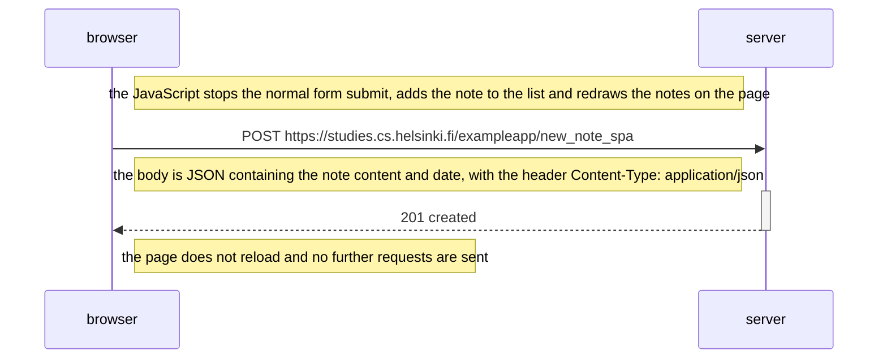

```mermaid
sequenceDiagram
    participant browser
    participant server

    Note right of browser: the JavaScript stops the normal form submit, adds the note to the list and redraws the notes on the page

    browser->>server: POST https://studies.cs.helsinki.fi/exampleapp/new_note_spa
    Note right of browser: the body is JSON containing the note content and date, with the header Content-Type: application/json
    activate server
    server-->>browser: 201 created
    deactivate server

    Note right of browser: the page does not reload and no further requests are sent
```